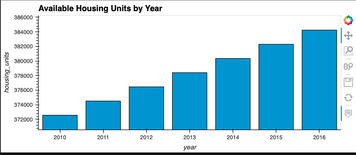
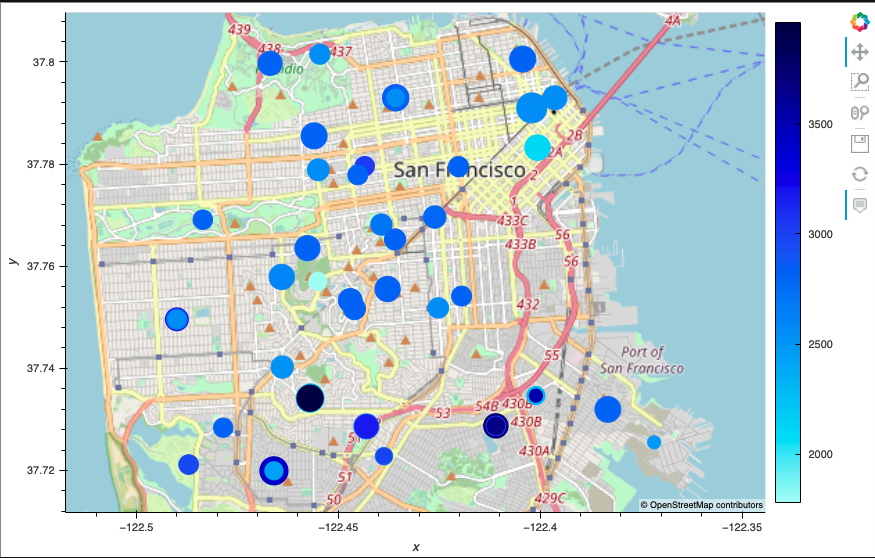
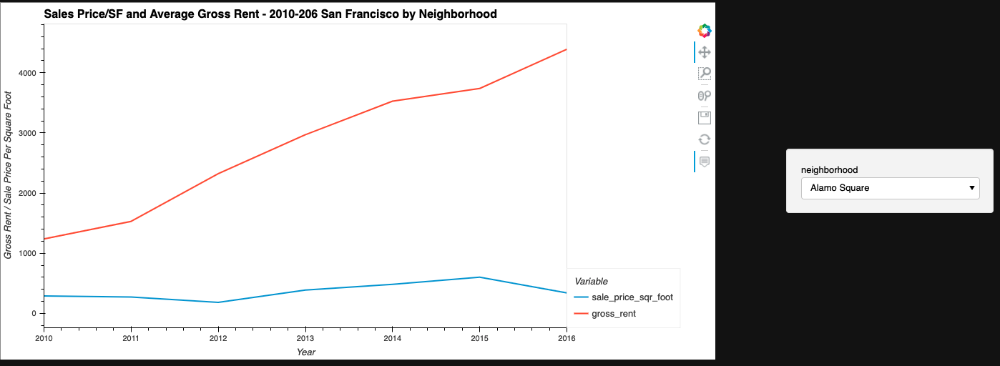

# Challenge_Six

## Housing Rental Analysis for San Francisco
The goal of the assignemnt was to compare the rental market in San Francisco to the sales Prices per Square Foot.  My findings were very interesting in that the gross rental price continued to jump higher and higher with more volatility, while the sales price/sf was a slower upward grind with a few more flucations.

## Examples

## Contributors
Matthew P Rudd - mprudd2@gmail.com

## License 
MIT